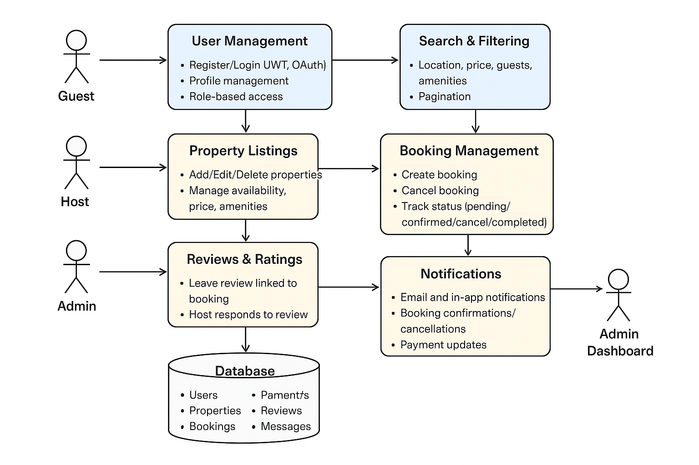

# Airbnb Clone Backend: Features and Functionalities

This directory contains the documented features and functionalities for the Airbnb Clone backend. The goal is to provide a clear blueprint of the system before development begins.

## Overview

The Airbnb Clone backend will provide a RESTful API (or GraphQL) to handle:

- User accounts (registration, login, profile management)
- Property listings management (create, edit, delete)
- Search and filtering of properties
- Booking system (create, cancel, track status)
- Payment processing and integration with gateways
- Reviews and ratings management
- Notifications system (email and in-app)
- Admin dashboard for managing users, listings, bookings, and payments

## Key Features

1. **User Management**
   - Registration/Login (JWT, OAuth)
   - Role-based access (Guest, Host, Admin)
   - Profile management (update info, profile photo)

2. **Property Listings**
   - Add/Edit/Delete properties
   - Manage availability, price, and amenities

3. **Search & Filtering**
   - Filter by location, price, guests, amenities
   - Pagination for large datasets

4. **Booking Management**
   - Create and cancel bookings
   - Track status: pending, confirmed, canceled, completed
   - Prevent double bookings

5. **Payment Integration**
   - Support for Stripe, PayPal
   - Multi-currency handling
   - Automatic payouts to hosts

6. **Reviews & Ratings**
   - Guests leave reviews linked to bookings
   - Hosts respond to reviews

7. **Notifications**
   - Booking confirmations and cancellations
   - Payment updates

8. **Admin Dashboard**
   - Monitor and manage users, listings, bookings, payments

## Technical Considerations

- Relational database (PostgreSQL or MySQL)
- RESTful API endpoints with proper HTTP methods and status codes
- JWT authentication and role-based access control
- File storage for images (AWS S3, Cloudinary)
- Email notifications via SendGrid or Mailgun
- Global error handling and logging
- Performance optimization (caching with Redis)
- Unit and integration testing

## Diagram

A visual representation of all features and their relationships can be found in the exported diagram below:

---

**Repository:** `alx-airbnb-project-documentation`  
**Directory:** `features-and-functionalities/`
